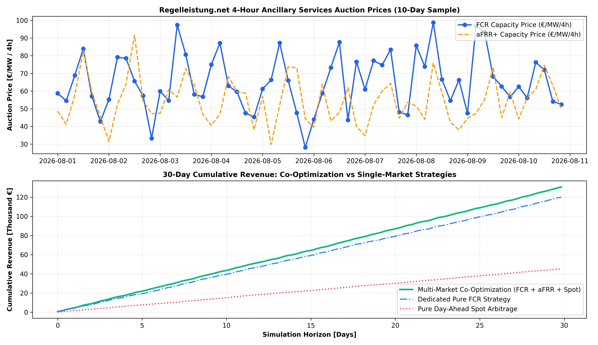

# ⚡ BESS Ancillary Services (FCR & aFRR) Bidding & Revenue Co-Optimization

A quantitative bidding strategy and revenue co-optimization engine evaluating **4-hour frequency reserve auctions (FCR / aFRR) on Regelleistung.net** versus **Day-Ahead wholesale arbitrage** for a **10 MW / 20 MWh Utility BESS in Germany**.

---

## 📌 Market Architecture & Bidding Dynamics

* **FCR (Frequency Containment Reserve):** Symmetrical 4-hour capacity reserve (€/MW/4h) requiring a 30-minute alert duration reserve around 50% State of Charge (SOC).
* **aFRR (automatic Frequency Restoration Reserve):** Asymmetrical positive/negative capacity procurement coupled with real-time activation energy settlement.
* **Co-Optimization Engine:** Evaluates opportunity costs in real-time across 180 four-hour auction blocks, dynamically shifting capacity between FCR capacity reservation, aFRR, and Day-Ahead spot price spikes.

---

## 📊 30-Day Revenue Benchmark (10 MW / 20 MWh BESS)

| Monetization Strategy | 30-Day Total Revenue | PnL Uplift vs Spot Arbitrage | Asset Allocation Share |
| :--- | :---: | :---: | :---: |
| **Multi-Market Co-Optimization** | **€130,503.36** | **+€85,289.93 (+188.6%)** | **FCR: 54.4% \| aFRR: 45.0% \| Spot: 0.6%** |
| **Dedicated Pure FCR Strategy** | €119,858.70 | +€74,645.27 (+165.1%) | FCR: 100.0% |
| **Pure Day-Ahead Spot Arbitrage** | €45,213.43 | Baseline | Spot Arbitrage: 100.0% |

---

## 📈 Visual Benchmark: 4-Hour Auction Cleared Prices & Cumulative Revenue

---

## 🛠️ Tech Stack
* **Language:** Python 3.10+
* **Quantitative Modeling:** `pandas`, `numpy`
* **Visualization:** `matplotlib`
